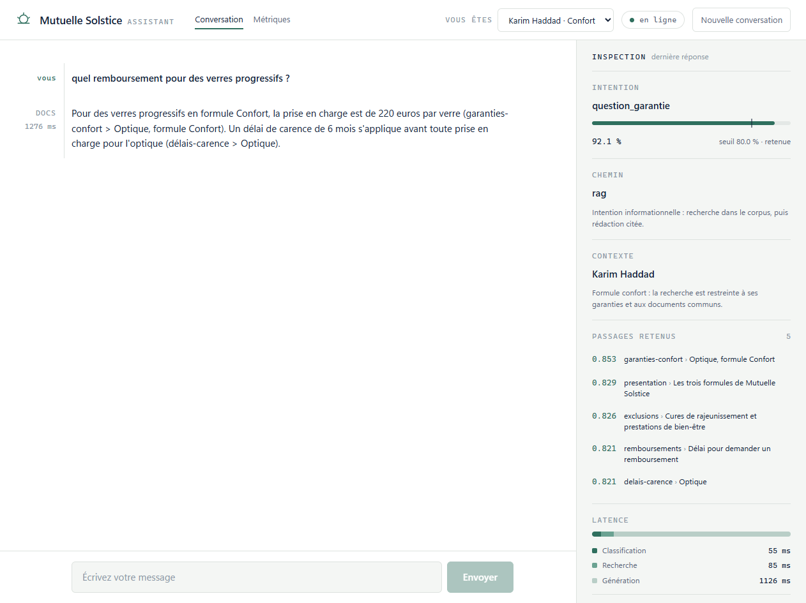
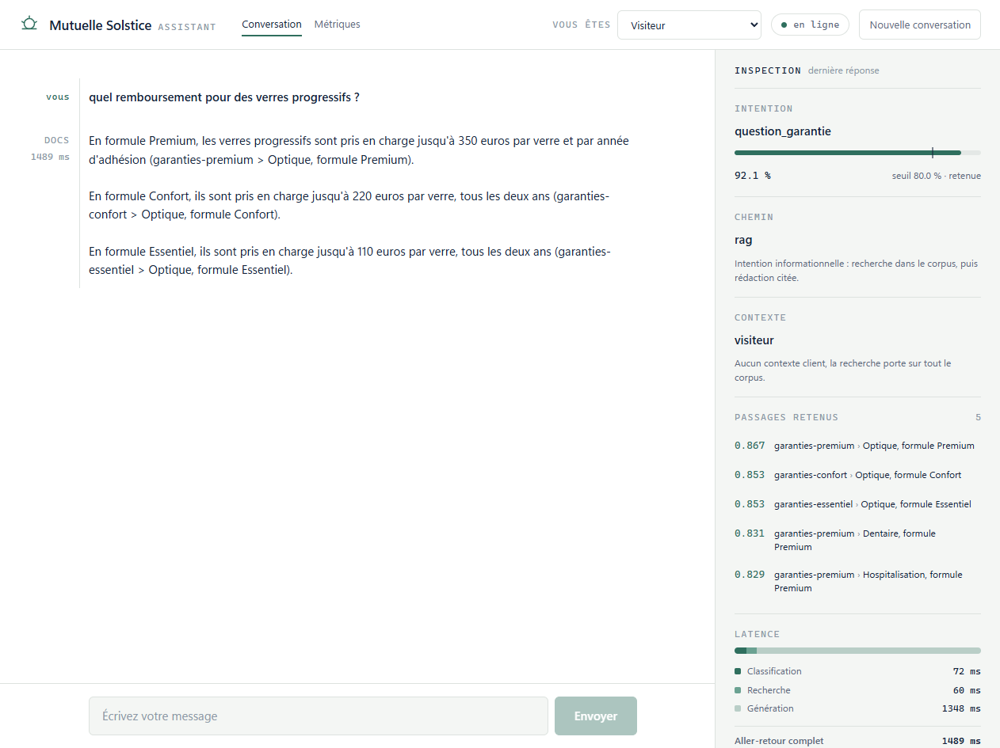
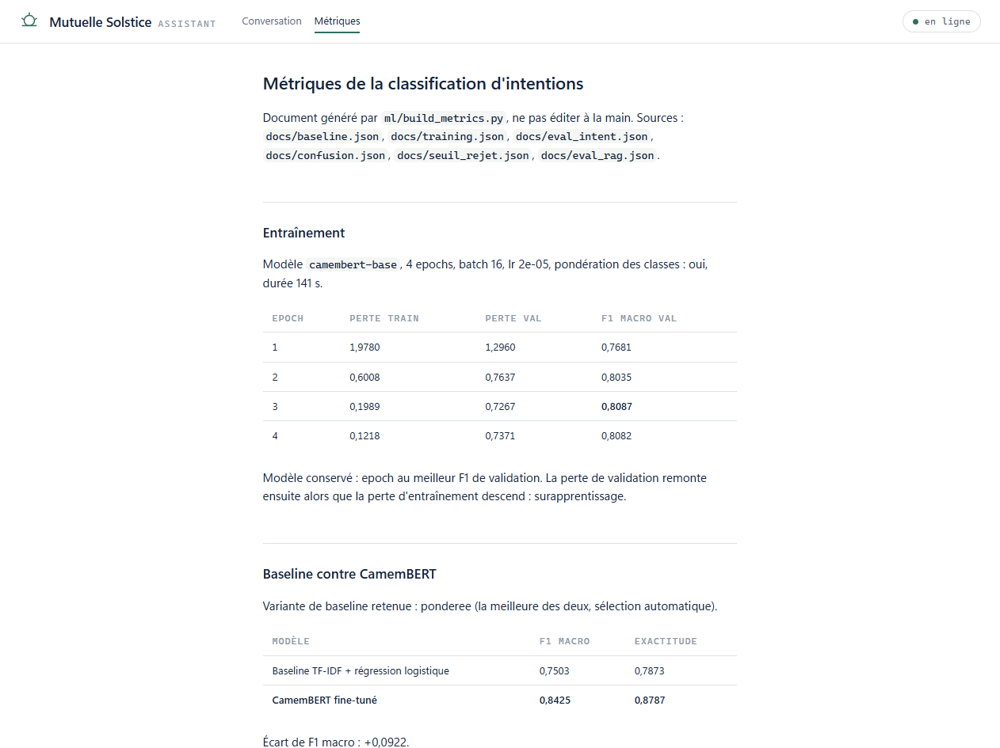

# Assistant assurance : classification d'intentions + RAG



Assistant conversationnel pour une mutuelle santé fictive. Il classe l'intention
du message avec un CamemBERT fine-tuné, puis route vers un dialogue guidé pour
les demandes transactionnelles, ou vers une recherche documentaire (RAG) dans
les conditions générales pour les questions informationnelles. Chaque réponse
affiche à droite comment elle a été obtenue : intention reconnue et confiance
face au seuil, chemin emprunté, passages cités avec leur score, temps passé à
chaque étape.

## Le cadre

Projet personnel. La compagnie, les onze documents du corpus, les 201 gabarits
d'intentions et les 50 questions d'évaluation ont été écrits pour ce projet. Il
reprend l'idée d'un assistant interne que j'ai développé en poste chez un
assureur, sans en reprendre aucune donnée, aucun code ni aucun document.

Ce qu'il cherche à démontrer, dans cet ordre : une chaîne NLP complète et
évaluée honnêtement, un RAG mesuré plutôt que seulement fonctionnel, et une
chaîne de service qui va du modèle jusqu'à l'écran.

## Architecture

```
Front Angular 22          :4200   chat annoté + panneau d'inspection, proxy /api
Passerelle Spring Boot    :8080   sessions, contexte client, journal, 503/502/400
Service IA FastAPI        :8000   courtoisie, classifieur, routeur, recherche, génération
PostgreSQL 16 + pgvector  :5433   94 passages indexés, HNSW cosinus
```

Le service Python est **sans état** : l'état du dialogue entre et sort par le
corps des requêtes. La passerelle le garde en base et le front ne le voit
jamais, il ne transporte qu'un identifiant de session. L'état voyage à travers
la passerelle sous forme opaque, sans classe Java miroir : quand le service
Python a gagné un champ, aucune ligne de Java n'a eu à changer.

## La classification d'intentions

12 intentions, 201 gabarits répartis en trois pools strictement disjoints
(110 / 42 / 49), 5 000 phrases d'entraînement, 800 de validation, 536 de test.

| | Baseline TF-IDF | CamemBERT fine-tuné |
|---|---|---|
| F1 macro | 0,7503 | **0,8425** |
| Exactitude | 0,7873 | **0,8787** |
| Messages mal routés | 16,6% | **4,9%** |

Hors cas volontairement ambigus, l'exactitude de CamemBERT monte à 0,912.

**Ce que ces chiffres ne démontrent pas.** Les phrases d'un même gabarit ne sont
pas indépendantes : la taille effective du jeu de test est de **64 unités**, pas
536 lignes. Au niveau ligne, l'avantage de CamemBERT est massif (McNemar,
p < 0,0001) ; au niveau des unités, il gagne 16 fois, perd 8 fois, égalise 40
fois, et le test des signes donne p 0,15. L'écart se constate, il ne se démontre
pas. C'est le genre de nuance qu'un tableau seul fait disparaître.

**Seuil de rejet 0,80**, obtenu par une règle écrite avant de voir les chiffres
(couverture d'au moins 80%, puis durcissement tant qu'un cran évite au moins
0,2 erreur par question légitime perdue). Couverture 82,7%, exactitude sur les
messages acceptés 97,5%, et surtout : **31 flux métier déclenchés à tort
ramenés à 4**. Sous le seuil, l'assistant demande une reformulation au lieu de
deviner.

## Le RAG

11 documents, environ 6 000 mots. 50 questions écrites à la main, dont 34 ont
une réponse dans le corpus et 16 n'en ont pas. Cinq configurations mesurées :

| Configuration | recall@5 | MRR@10 | réponses correctes | refus corrects | faux refus |
|---|---|---|---|---|---|
| naïf, vectoriel | 32/34 | 0,706 | 27/34 | 14/16 | 5 |
| titres, vectoriel | 31/34 | 0,855 | 30/34 | 15/16 | 0 |
| **titres + fil, vectoriel** | 32/34 | 0,844 | **30/34** | **16/16** | 3 |
| titres, hybride | 30/34 | 0,773 | 29/34 | 16/16 | 0 |
| titres + fil, hybride | 30/34 | 0,767 | 28/34 | 16/16 | 3 |

Quatre conclusions, chacune payée par une mesure :

1. **Le recall@5 flatte le découpage naïf**, dont le top 5 couvre 23% d'un index
   de 22 passages contre 5% pour 94. La colonne des réponses correctes le
   démasque : il répond même à deux questions sans réponse.
2. **La recherche hybride coûte sur ce corpus.** Même après retrait des mots
   vides et des scores BM25 nuls, elle reste sous le vectoriel seul. Sur des
   sections courtes et autosuffisantes interrogées par des questions
   reformulées, BM25 n'apporte pas de signal complémentaire.
3. **Il n'existe pas de seuil de pertinence** : le score minimum des questions
   faciles (0,814) est sous le maximum des questions sans réponse (0,872). Le
   refus repose entièrement sur les consignes de génération, qui tiennent 16/16.
4. **Le contexte partiel est plus dangereux que l'absence de contexte.** L'unique
   réponse incorrecte vient d'un cas où un seul des deux extraits nécessaires
   est remonté : le modèle a improvisé un calcul au lieu de refuser.

La configuration retenue est **titres + fil, vectoriel**, choisie sur un
arbitrage explicite : à réponses correctes égales, elle refuse sans exception
les questions sans réponse, au prix de 3 refus à tort. Pour un assistant
d'assurance, inventer une réponse est une faute, refuser à tort une friction.

## Le contexte client filtre la recherche

C'est l'apport concret de la passerelle Java. La même question, sans nom de
formule, posée par un visiteur puis par un client dont le contrat est connu.

**Visiteur.** Les garanties des trois formules se disputent le haut du
classement (Premium 0,867, Confort 0,853, Essentiel 0,853). La réponse est
correcte, mais générique : elle énumère les trois.



**Karim Haddad, formule Confort.** La passerelle déduit la formule de son
contrat et la transmet au service, qui restreint la recherche à ses garanties et
aux documents communs. La bonne section passe au premier rang, les deux formules
concurrentes disparaissent du top 5, et la réponse donne son montant, plus le
délai de carence applicable, trouvé dans un second document.

Le front n'envoie jamais de formule : il envoie un identifiant de client.

**Limite mesurée et assumée** : ce contexte filtre la recherche, il n'entre pas
dans le message classé. La même question sort à 0,502 sans nom de formule contre
0,806 avec, et le contexte client n'y change rien.

## Les métriques dans l'application



`docs/metrics.md` est **généré** par `ml/build_metrics.py` à partir des fichiers
JSON de résultats, jamais rédigé à la main, et le front l'affiche tel quel. Même
principe pour le seuil de rejet dessiné sur la jauge de confiance : il est lu
depuis `/api/health`, jamais codé en dur, pour qu'il ne puisse pas diverger de
celui qui décide réellement.

## Lancer le projet

Prérequis : Python 3.12, Docker Desktop, Java 17 et Maven, Node 24 LTS, une clé
API Mistral (ou n'importe quel service compatible `chat/completions`, Ollama
compris, via `LLM_BASE_URL`).

```powershell
copy .env.example .env      # y mettre MISTRAL_API_KEY
.\.venv\Scripts\Activate.ps1
python -m pip install -r requirements.txt

.\run.ps1 all               # données, entraînement, indexation, évaluation
.\run.ps1 up                # les trois services, une fenêtre chacun
```

`.\run.ps1` sans argument liste les cibles. L'évaluation du RAG n'est rejouée
qu'avec `-AvecGeneration`, parce qu'elle consomme environ 500 appels au modèle
de génération.

Ports : 5433 base, 8000 service IA, 8080 passerelle, 4200 front.

## Limites

Elles sont dans **[`docs/limites.md`](docs/limites.md)**, et ce document fait
partie du projet au même titre que les chiffres. Les principales : le jeu de
test est généré et non annoté, sa taille effective est de 64 unités, la
calibration du modèle est mauvaise (ECE 0,106) donc le seuil est heuristique, le
corpus est plus régulier qu'une documentation réelle, le RAG n'a jamais été
évalué en multi-tours, et les réponses sont jugées par le modèle qui les génère.

## Avec plus de temps

- Une treizième intention pour la politesse et la clôture, aujourd'hui traitées
  par un pré-filtre lexical, au prix d'un réentraînement et de la régénération
  de tous les chiffres publiés.
- La réécriture de requête à partir de l'historique, pour que « et en
  Premium ? » soit une question résoluble.
- Un juge indépendant du générateur pour l'évaluation du RAG.
- Un corpus réel et annoté, où l'accord inter-annotateurs deviendrait lui-même
  une métrique.

## Le dépôt

```
data/         référentiels, générateur d'intentions, corpus, jeux d'évaluation
ml/           baseline, entraînement, évaluations, indexation, génération des métriques
service/      classification, recherche, génération, routeur, API FastAPI
gateway/      passerelle Spring Boot
front/        application Angular
docs/         résultats chiffrés, métriques générées, limites, captures
run.ps1       rejoue la chaîne et démarre les services
```