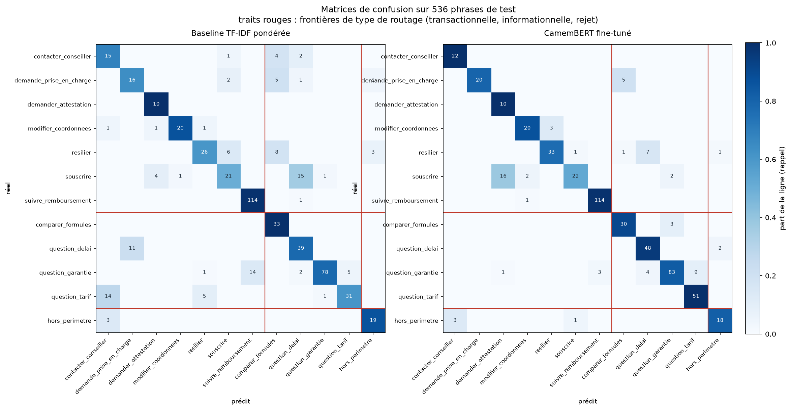

# Métriques de la classification d'intentions

Document généré par `ml/build_metrics.py`, ne pas éditer à la main.
Sources : `docs/baseline.json`, `docs/training.json`, `docs/eval_intent.json`, `docs/confusion.json`, `docs/seuil_rejet.json`, `docs/eval_rag.json`.

## Entraînement

Modèle `camembert-base`, 4 epochs, batch 16, lr 2e-05, pondération des classes : oui, durée 141 s.

| Epoch | Perte train | Perte val | F1 macro val |
|---|---|---|---|
| 1 | 1,9780 | 1,2960 | 0,7681 |
| 2 | 0,6008 | 0,7637 | 0,8035 |
| 3 | 0,1989 | 0,7267 | **0,8087** |
| 4 | 0,1218 | 0,7371 | 0,8082 |

Modèle conservé : epoch au meilleur F1 de validation. La perte de validation remonte ensuite alors que la perte d'entraînement descend : surapprentissage.

## Baseline contre CamemBERT

Variante de baseline retenue : ponderee (la meilleure des deux, sélection automatique).

| Modèle | F1 macro | Exactitude |
|---|---|---|
| Baseline TF-IDF + régression logistique | 0,7503 | 0,7873 |
| **CamemBERT fine-tuné** | **0,8425** | **0,8787** |

Écart de F1 macro : +0,0922.

### Exactitude par difficulté (même métrique des deux côtés)

| Difficulté | n | Baseline | CamemBERT |
|---|---|---|---|
| facile | 137 | 0,8029 | 0,9124 |
| bruite | 363 | 0,8072 | 0,9118 |
| ambigu | 36 | 0,5278 | 0,4167 |

L'écart sur les cas ambigus porte sur 36 lignes et vaut quelques phrases : il ne permet pas de conclure, voir `docs/limites.md`.

## Routage

Une erreur qui reste dans le même type (transactionnelle, informationnelle, rejet) laisse le routeur sur le bon chemin ; une erreur inter-type l'envoie ailleurs.

| | Baseline | CamemBERT |
|---|---|---|
| Erreurs | 114 | 65 |
| dont changement de chemin | 89 | 26 |
| **Messages mal routés** | **16,6%** | **4,9%** |
| Erreurs restant sur le bon chemin | 21,9% | 60,0% |

Matrices ordonnées par type de routage, générées par `ml/plot_confusion.py`.

## Seuil de rejet

Calibration : ECE 0,1058, confiance moyenne 0,8537 pour une exactitude de 0,8787.

Règle de sélection : couverture >= 80%, puis durcissement du seuil tant qu'il reduit les flux metier declenches a tort avec un rendement marginal d'au moins 0.2 erreur evitee par legitime perdue.

| | sans seuil | seuil 0,800 |
|---|---|---|
| couverture (lignes) | 100,0% | 82,7% |
| couverture (gabarits) | 100,0% | 74,1% |
| exactitude sur acceptés | 87,9% | 97,5% |
| flux métier déclenchés à tort | 31 | 4 |

## Comparaison appariée baseline contre CamemBERT

Les deux modèles sont évalués sur les mêmes phrases, dans le même ordre (vérifié par le script). Comparaison des désaccords :

| | n |
|---|---|
| les deux corrects | 407 |
| les deux faux | 50 |
| baseline seule correcte | 15 |
| CamemBERT seul correct | 64 |

Test de McNemar (binomial exact) au niveau ligne : p < 0,0001. Les lignes d'un même gabarit n'étant pas indépendantes, ce chiffre surestime la certitude ; au niveau des unités indépendantes, CamemBERT fait mieux sur 16 unités, moins bien sur 8, égalité sur 40 (test des signes : p 0,1516). À ce niveau, l'écart n'atteint pas le seuil conventionnel de signification : 64 unités ne suffisent pas à trancher, voir `docs/limites.md`.

### Les cas ambigus que la baseline réussit et que CamemBERT rate

| Phrase | Réel | CamemBERT prédit |
|---|---|---|
| je viens d'adhérer et j'ai besoin de lunettes cordialement | question_delai | hors_perimetre |
| bonjour j'ai changé de banque | modifier_coordonnees | resilier |
| salut quelle formule pour être bien remboursé | comparer_formules | question_garantie |
| quelle formule pour être bien remboursé | comparer_formules | question_garantie |
| je vous explique ma situation, mon fils a 22 as, il est encore couvert | question_garantie | suivre_remboursement |
| bonsoir, quelle formule pour être bien remboursé | comparer_formules | question_garantie |
| mon fils a 22 ans, il est encore couvert | question_garantie | suivre_remboursement |
| je viens d'adhérer et j'ai besoin de lunettes | question_delai | hors_perimetre |
| je ne comprends pas mon relevé | suivre_remboursement | modifier_coordonnees |
| désolé de vous déranger mais mon fils a 22 ans, il est encore couvert | question_garantie | suivre_remboursement |

Sur les cas ambigus, la baseline est seule correcte 10 fois, CamemBERT seul correct 6 fois.

### Prédictions contre support : les classes sur-prédites

Classes prédites au moins 25% au delà de leur support par au moins un des deux modèles :

| Classe | Support | Prédictions baseline | Prédictions CamemBERT |
|---|---|---|---|
| demander_attestation | 10 | 15 | 27 |
| contacter_conseiller | 22 | 33 | 25 |
| comparer_formules | 33 | 50 | 36 |

Deux mécanismes distincts : la baseline pondérée sur-prédit les classes rares par construction (`class_weight="balanced"`), avec un rappel parfait payé en précision, ce qui explique une partie de son avantage sur les phrases à étiquette arbitrée. La sur-prédiction de `demander_attestation` par CamemBERT est un phénomène différent : l'effet de gabarit analysé ci-dessous.

## Analyse des erreurs, groupée par gabarit

Les phrases d'un même gabarit ne sont pas indépendantes : une erreur porte le plus souvent sur un gabarit entier. Les 65 erreurs de CamemBERT se réduisent à quelques groupes (gabarit, intention prédite).

| n | Gabarit | Réel | Prédit | Confiance moy. | Explication |
|---|---|---|---|---|---|
| 8 | il y a un questionnaire de santé pour adhérer | souscrire | demander_attestation | 0,65 | Même mécanique : un document nommé dans la phrase l'emporte sur l'intention d'adhésion. |
| 8 | quels documents pour adhérer | souscrire | demander_attestation | 0,71 | Le gabarit parle de pièces à fournir, vocabulaire entier de demander_attestation ; le modèle attrape le mot saillant. |
| 7 | quelle est la procédure pour partir | resilier | question_delai | 0,64 | Aucun mot de résiliation dans la phrase ; "procédure pour partir" ressemble aux questions de démarches et de délais. |
| 5 | je suis convoqué pour une intervention, quelle démarche | demande_prise_en_charge | comparer_formules | 0,43 | Vocabulaire médical peu vu à l'entraînement pour cette intention ; confiance 0,43, le seuil rejette ces lignes. |
| 4 | combien je suis remboursé pour {acte} | question_garantie | question_tarif | 0,54 | "combien" tire vers le tarif ; la frontière garantie/tarif tient à l'opposition remboursé/payé, ténue dans une phrase courte. |
| 3 | combien je paye pour les lunettes | question_garantie | question_tarif | 0,91 | Cas ambigu arbitré en garantie (reste à charge contre cotisation) ; le modèle choisit l'autre lecture, défendable, avec confiance 0,91. |
| 3 | j'ai changé de banque | modifier_coordonnees | resilier | 0,78 | Constat sans demande ; le changement de banque est associé au départ plutôt qu'à la mise à jour du RIB. |
| 3 | je cherche un médecin près de chez moi | hors_perimetre | contacter_conseiller | 0,79 | Demande de service formulée poliment : le modèle propose un humain au lieu de reconnaître le hors périmètre. |
| 3 | mon fils a 22 ans, il est encore couvert | question_garantie | suivre_remboursement | 0,67 | Cas ambigu (conditions de rattachement) ; "encore couvert" est lu comme le suivi d'un dossier existant. |
| 3 | quelle formule pour être bien remboursé | comparer_formules | question_garantie | 0,56 | Cas ambigu arbitré en comparer_formules ; "bien remboursé" tire vers les garanties, c'est l'autre branche de l'arbitrage. |
| 2 | est ce que j'ai droit à {acte} | question_garantie | question_delai | 0,46 | "avoir droit" évoque les conditions et délais de carence ; confiance 0,46, rejetée par le seuil. |
| 2 | est ce que je peux changer de formule maintenant | souscrire | modifier_coordonnees | 0,61 | Cas ambigu arbitré en souscrire ; le modèle attrape "changer" comme une modification, encore un mot saillant. |
| 2 | il y a un questionnaire de santé pour adhérer | souscrire | question_garantie | 0,60 | Dispersion résiduelle du même gabarit documents : "santé" part cette fois vers les garanties. |
| 2 | je viens d'adhérer et j'ai besoin de lunettes | question_delai | hors_perimetre | 0,50 | Cas ambigu, le délai de carence est sous-entendu sans être nommé ; sans mot interrogatif, le modèle ne rattache la phrase à rien. |
| 2 | l'implant c'est pris en charge et sous combien de temps | question_garantie | question_delai | 0,91 | Deux intentions dans une phrase, arbitrée en garantie ; le modèle répond à l'autre moitié avec confiance 0,91. Inévitable par construction. |
| 2 | les lunettes c'est combien | question_garantie | question_tarif | 0,90 | Même ambiguïté que "combien je paye pour les lunettes", même bascule. |
| 1 | comment je fais pour résilier | resilier | hors_perimetre | 0,44 | Le mot résilier est pourtant explicite ; formulation isolée à confiance 0,44, rejetée par le seuil. |
| 1 | est ce que j'ai droit à {acte} | question_garantie | demander_attestation | 0,32 | Confiance 0,32, le minimum du modèle sur tout le jeu : dispersion résiduelle, sans signal exploitable. |
| 1 | je ne comprends pas mon relevé | suivre_remboursement | modifier_coordonnees | 0,44 | Cas ambigu entre suivi et conseiller ; le modèle part sur une troisième lecture, à faible confiance. |
| 1 | je ne veux plus de votre mutuelle | resilier | souscrire | 0,59 | La négation inverse le sens : "veux" plus "mutuelle" sont lus comme une adhésion. Le contresens classique des modèles de classification. |

Les cas d'origine ambiguë sont arbitrés dans `data/eval/cas_ambigus.md`.

## Évaluation du RAG : cinq configurations sur 50 questions

50 questions écrites à la main : 34 à réponse, 16 sans réponse, soit 50 unités indépendantes. La recherche est mesurée par recall@5 et MRR@10 ; les réponses sont générées puis jugées par LLM (correct, incorrect ou refus), limites du juge dans `docs/limites.md`.

| Configuration | recall@5 | MRR@10 | réponses correctes | refus corrects | faux refus |
|---|---|---|---|---|---|
| naif, vectoriel | 32/34 | 0,706 | 27/34 | 14/16 | 5 |
| titres, vectoriel | 31/34 | 0,855 | 30/34 | 15/16 | 0 |
| **titres + fil, vectoriel** | 32/34 | 0,844 | 30/34 | 16/16 | 3 |
| titres, hybride | 30/34 | 0,773 | 29/34 | 16/16 | 0 |
| titres + fil, hybride | 30/34 | 0,767 | 28/34 | 16/16 | 3 |

Configuration retenue pour le service : **titres + fil, vectoriel**. À réponses correctes égales (30/34), elle refuse les 16 questions sans réponse sans exception ; ses 3 faux refus sont le prix accepté de cette prudence, inventer une réponse étant une faute là où refuser à tort n'est qu'une friction.

Le recall@5 avantage structurellement le découpage naïf (top 5 sur un index de 22 chunks contre 94) ; la colonne des réponses correctes le démasque.

Aucun seuil de pertinence exploitable sur le cosinus de tête : minimum des questions faciles 0,814, maximum des sans réponse 0,872. Le refus des questions hors documentation repose sur les consignes de génération.
